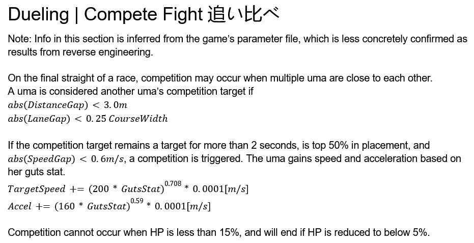
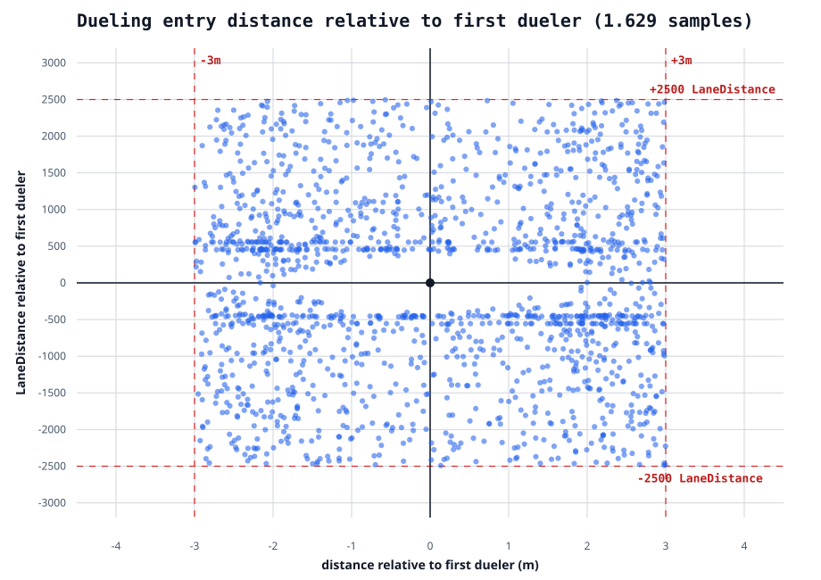
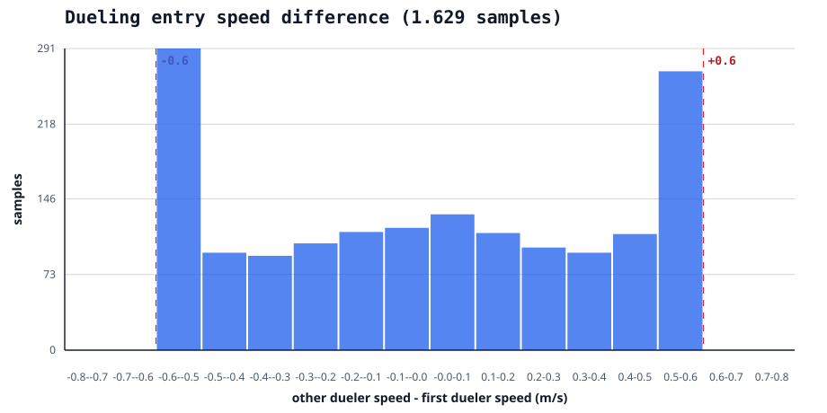
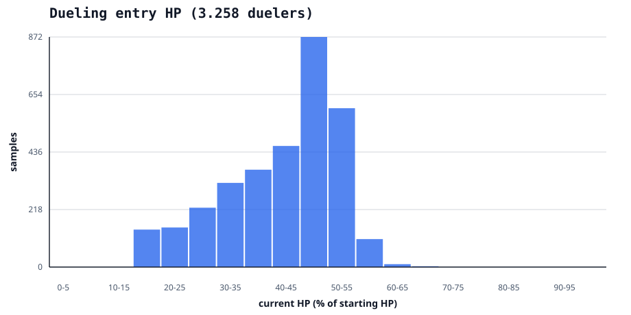
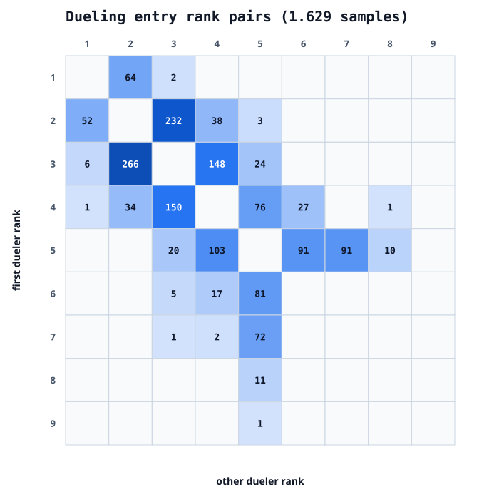

# Dueling mechanics

Following my recent analysis of the precise mechanics behind [spot struggle](https://hakuraku.moe/notes/spot-struggle), this article examines dueling in similar detail.

The goal is to verify the community's current understanding of how duels begin and end, as well as document several less widely known behaviors, particularly the distance based exit condition.

## Baseline mechanics

[kuromiAK's mechanics document](https://docs.google.com/document/d/15VzW9W2tXBBTibBRbZ8IVpW6HaMX8H0RP03kq6Az7Xg/edit?tab=t.0#heading=h.5l523bk8k3vz) summarizes the community's current understanding of dueling. At the time of writing, the relevant section is as follows:



The game's parameter file contains the following values:

```json
"CompeteFight": {
  "DistanceGap": 3.0,
  "LaneGap": 0.25,
  "TargetContinueTime": 2.0,
  "SpeedGap": 0.6000000238418579,
  "TargetOrderPer": 50,
  "TargetContinueDistance": 5.0,
  "HpPer": 5,
  "HpPer2": 15,
  "AddParam1Coef1": 200.0,
  "AddParam1Coef2": 0.7080000042915344,
  "AddParam1Coef3": 0.00009999999747378752,
  "AddParam2Coef1": 160.0,
  "AddParam2Coef2": 0.5899999737739563,
  "AddParam2Coef3": 0.00009999999747378752
}
```

Several of these values correspond directly to known entry and exit conditions. For example, DistanceGap appears to define the required 3m proximity, while TargetContinueTime specifies that a target must be maintained for 2 seconds.

## Data source

Unlike my spot struggle investigation, this analysis did not require specially prepared test characters. Instead, I used aggregate data and selected individual races from the CM14 umalogs dataset.

## Entry conditions

The following graphs compare observed duel entries against the currently understood requirements:









This dataset includes only races in which exactly 2 umas entered a duel. Restricting the sample in this way avoids ambiguity over which uma targeted which.

Specifically, I looked at duels where we received the exact simulation frame before the duel, as duels appear to begin 1 frame after conditions are met.

The observed entries agree closely with the known conditions:

- The umas must remain sufficiently close for 2 continuous seconds.
- Their current speed difference must be no greater than 0.6 m/s.
- Both umas must have at least 15% HP.
- At least one of the 2 umas must be in the top 50% of the field.

Only one uma needs to satisfy the top 50% requirement. That uma acts as the duel target.

The earliest duel in the dataset began at 1141m, 41m after the start of the final straight. This delay is consistent with the requirement that a valid target remain nearby for 2 seconds.

There does not appear to be a deadline after which a duel can no longer begin. In rare cases, an uma may even enter a duel after crossing the finish line. However, no uma in the dataset triggered a second duel after leaving her first one.

## Which conditions must be maintained for 2 seconds?

Dueling has several entry conditions, but the evidence suggests that most of them do not need to remain satisfied for the full 2 second period.

Late duel activations are especially useful for investigating this. Around the time the winning uma crosses the finish line, the server sends us every simulation frame, allowing us to see exactly when each condition changes.

### HP

In the race below, Taiki has 12.6% HP on the 75.12s frame. She then activates Radiant Star, raising her HP to 16.6% on the 75.19s frame. This immediately makes her a valid duel target for the nearby Gold Ship, and the duel begins on the following frame.

https://hakuraku.moe/racedata?kv=djcTsh1gTFidL5QiziMJoOST

This shows that the 15% HP requirement only needs to be satisfied immediately before the duel begins.

### Position

In the race below, Taishin moves into 5th place on the 73.59s frame, placing her within the top 50% of the field. This makes her a valid duel target for King Halo, and the duel begins one frame later.

https://hakuraku.moe/racedata?kv=zH6tV9bidp0zjoIb1dx7TEGk

The position requirement therefore also appears to be checked only at the moment of activation.

### Speed difference

In the race below, Daiwa activates Straightaway Adept on the 73.66s frame. By the 73.73s frame, her current speed is within 0.6 m/s of Inari One's. The duel begins on the following frame.

https://hakuraku.moe/racedata?kv=Ml22hppa_AZHi77Bc2QiJaFp

This indicates that the speed requirement also needs to be met for only a single frame.

Taken together, these examples show that the HP, position, and speed requirements do not need to remain satisfied for 2 seconds. I also found no comparable cases in which a duel triggered immediately after 2 umas first moved close to each other.

The most likely interpretation is therefore that the 2 second duration applies only to the proximity requirements:

- No more than 3m of forward or backward separation.
- No more than 2500 units of LaneDistance separation.

Once that proximity has been maintained for 2 seconds, the remaining HP, position, and speed conditions all need to be true together on just one frame.

### Former duel participants cannot become new targets

An uma who has already left a duel no longer appears to be a valid target for another uma attempting to begin one.

In the race below, Seiun Sky remains close to her teammate Mihono Bourbon from approximately the 103.36s frame onward. Initially, their speed difference is too large for a duel to begin. Shortly afterward, Bourbon's existing duel ends and the speed gap becomes small enough, but Seiun Sky still cannot trigger a duel with her.

https://hakuraku.moe/racedata?kv=VsDkEL7yWlqKki-Zc4mfa0PZ

A similar sequence occurs in the race below. Oguri has remained close to Chiyono O for at least 2 seconds, but Chiyono O's unique skill and duel speed make the speed gap too large. Even after Chiyono O's duel ends and the speed difference decreases to below 0.6 m/s, Oguri cannot begin a duel with her.

https://hakuraku.moe/racedata?kv=CUxS7Ef2_vHTEzGSD7kzaEDU

These examples suggest that an uma becomes ineligible as a new duel target after leaving a duel.

## Exit conditions
### HP based exit

The best known exit condition is the 5% HP threshold.

In the race below, Narita Taishin falls below 5% HP for the first time on the 73.59s frame. On the following frames, she begins decelerating from her duel speed.

https://hakuraku.moe/racedata?kv=yxAnU5EnoP08MiDCPwjqbJC2

This behavior is consistent with the HpPer value of 5 in the game's parameter file.

### Distance based exit

As with spot struggle, dueling also appears to have a distance based exit condition, as indicated by the TargetContinueDistance value of 5.0.

### Two uma duels

The 2 uma case behaves much like spot struggle.

In the race below, Mihono Bourbon and Hishi Amazon reach a separation of 5m on the 74.99s frame. Both begin decelerating on the following frame.

https://hakuraku.moe/racedata?kv=91rqiJqceF6sCiNHRz0DehSr

This suggests that an uma leaves the duel once she is no longer within 5m of another relevant participant.

### Duels with 3 or more umas

Duels involving 3 umas reveal some differences from spot struggle.

For spot struggle, the distance based exit occurred only when an uma fell at least 5m behind every other participant. During a duel, an uma can leave by becoming separated in either direction, both getting ahead all of all other duelers or falling behind all other duelers by 5m will end your dueling state.

In the race below, Narita Taishin moves more than 5m ahead of both other duel participants on the 74.66s frame. She begins decelerating on the following frame.

https://hakuraku.moe/racedata?kv=-P-UjaMg5OQYMsBNEQ5VsbSE

In the race below, Mihono Bourbon instead falls more than 5m behind both other participants on the 74.66s frame. She also begins decelerating on the following frame.

https://hakuraku.moe/racedata?kv=I8tBX-KYRVHl10eH0xloa1Up

The distance-based exit condition therefore applies symmetrically. An uma exits when she is at least 5m ahead of or behind every other relevant uma.

## Former duelers still affect ongoing duels

A particularly unusual result is that umas who have already left a duel can still prevent nearby umas from leaving theirs.

Consider the following race:

https://hakuraku.moe/racedata?kv=xHuF40tHsCuyO4HQBQIVFiw-

The sequence is as follows:

1. Akebono begins dueling Nishino Flower at 57.143s.
2. Oguri joins the duel through Akebono at 60.607s.
3. At approximately 63.94s, Nishino Flower moves more than 5m ahead of both other participants and exits the duel.
4. Shortly before the 74.59s frame, Oguri moves 5m ahead of Akebono but remains in the duel.
5. On the 75.12s frame, Oguri also moves 5m ahead of Nishino Flower. She then exits, having become separated by at least 5m from both Akebono and Nishino Flower, decelerating on the following frames.
6. Akebono never stops dueling.

This sequence establishes 2 points.

First, a former duel participant can still satisfy the requirement that an active dueler remain within 5m of another relevant uma. Although Nishino Flower had already left the duel, her proximity was enough to keep Oguri's duel active.

Second, the game does not appear to care which uma was the original duel target. Oguri did not enter the duel through Nishino Flower, but still needed to become separated from her before exiting.

Unlike spot struggle, the final active dueler does not automatically leave the duel. As long as any uma who participated in a duel earlier in the race remains within 5m, the final active dueler can continue dueling.

The following races show similar behavior:

https://hakuraku.moe/racedata?kv=EsA58-w76TfV-UzBuEN-QIcD

https://hakuraku.moe/racedata?kv=0VkWCupfHtNtZAcpkWKrh2dK

In the race below, Tamamo, the final active dueler, stop dueling after moving 5m ahead of every uma who had participated in a duel earlier in the race, none of which are still actively dueling. This occurs on the 74.79s frame.

https://hakuraku.moe/racedata?kv=KjEEqOuv27tMejSUUrlc8mtt

## Conclusion

The observed entry conditions closely match the community's existing understanding of dueling.

A duel can begin when:

- 2 umas remain within 3m and 2500 LaneDistance units of each other for 2 continuous seconds.
- Their current speed difference is no greater than 0.6 m/s.
- Both have at least 15% HP.
- At least one of them is in the top 50% of the field.

The 2 second duration appears to apply only to the distance and lane-proximity requirements. The HP, position, and speed conditions need to be satisfied for only a single frame after the proximity requirement has been met.

An uma who has already left a duel cannot become the target of a new duel later in the race.

There are 2 confirmed ways to leave a duel:

- Falling below 5% HP.
- Becoming separated by at least 5m from every uma who has participated in a duel during that race.

The distance condition applies in both directions: an uma can leave by moving 5m ahead of everyone else or by falling 5m behind everyone else.

Former duel participants continue to count for this distance check even after leaving their own duel. As a result, the final active dueler does not automatically stop dueling, the duel can continue as long as any current or former participant remains within 5m.
