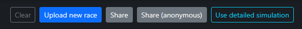
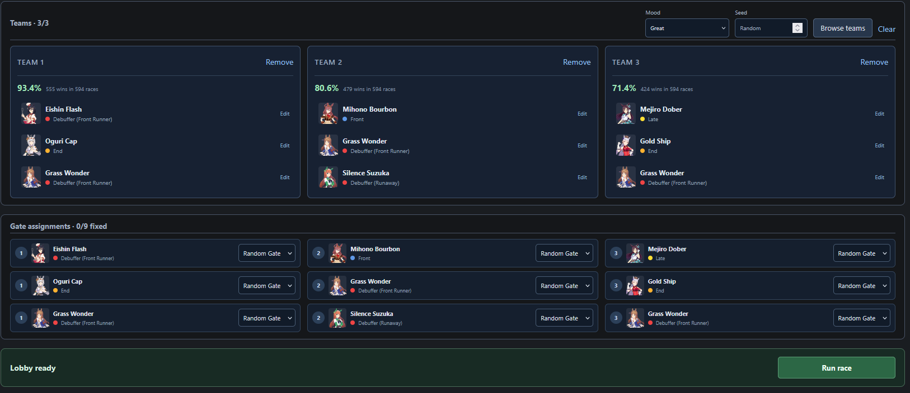

# A new age for Umamusume data

Thanks to some insane efforts from kakku and Tunnelblick, we now have access to a reimplementation of the server-side race simulator. This isn't anything like the umalators you know - we can take a race configuration and reproduce it locally, with simulation output matching the server race. The implications of this are quite interesting: the role of room matches can now move to letting us harvest team setups and estimate the popularity of different styles and umas, but there is little value in aggregating room match results for win rates when we can now simply collect the teams people are bringing and simulate them against each other as much as we'd like.

As far as immediate new features go, the [/racedata](/racedata) page now features a button to resimulate a race, which lets the page use simulator-reported information rather than the existing heuristics, as well as adding previously unavailable information like the duration of Fully Charged. During the initial rollout, this is restricted to 3v3v3 races matching the configuration of the currently upcoming CM only.

I've also launched a new page over at [/simdata](/simdata). This is a proof-of-concept replacement for [/umalogs](/umalogs), which I'd like to phase out eventually. It provides many of the same metrics, as well as new features like the Archetype Analysis tab, which lets you more conveniently browse the performance distribution of different team concepts and identify and analyze ideas you're interested in. I've seen a lot of talk about writing off certain running styles or umas in CMs based on their poor performance in aggregate win-rate data, when there is often a subset of players finding success with them. This feature makes those teams more discoverable so you can learn what sets them apart.

In terms of the statistics provided on the SimData page, the main difference is that the data is now fueled by simulated races, with appearances weighted per player. With UmaLogs, one issue was that individual player behavior had an impact on the observations, with some players entering their team into room matches hundreds of times, while other players appeared once and were never seen again. On the SimData page, both of these players now have a similar amount of evidence for their teams' strengths. When there are multiple known teams per player, two-thirds of that player's simulation budget will be used for their known highest-performing team, with the remaining one-third sampling previous teams.

Additionally, the Lobby Builder tab on the SimData page lets you simulate and watch CM matches. You can pick three teams from the data and watch them race each other, and even modify any of the umas to your liking to try out theoretical scenarios with different skills or stats.

Note that due to the short time until CM19 starts, the currently deployed SimData page is not continuously updated with newly collected teams, but frozen to a team collection state from around September 10 for testing. For future CMs, this is planned to become an incrementally updated dataset, similar to the UmaLogs page.

Look forward to more features built on these systems in the coming weeks and months.
