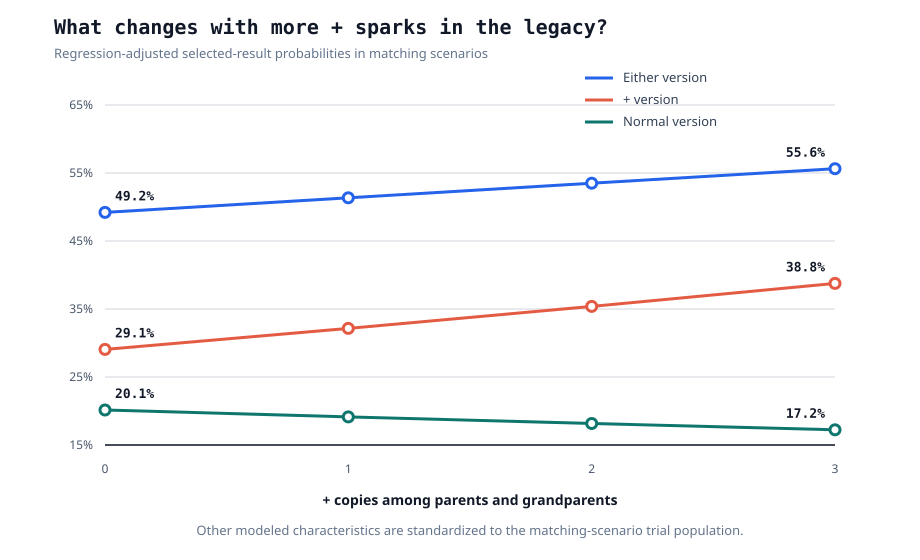
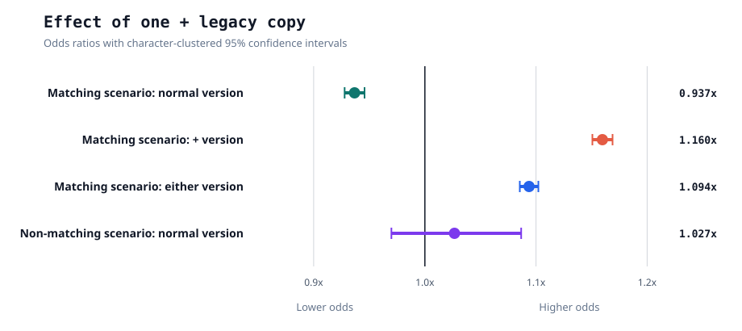

# Setting expectations

After the reroll patch, spark data got messier. Before, the sparks on a uma were just what the game rolled. Now players can reroll and keep whichever result they prefer, so post-patch data shows kept results, not the raw roll.

That matters for the new `+` scenario sparks. For example, `Ignited Spirit WIT` and `Ignited Spirit WIT +` both give the Ignited Spirit WIT skill, but the `+` version also gives stats. The `+` version only appears in its matching scenario:

- Racing Spirit `+`: URA
- Ignited Spirit `+`: Aoharu

The two questions I wanted to check were:

- Does the `+` version replace the normal version?
- Do `+` copies in your parents/grandparents help future sparks?

Because this is post-reroll data, everything below should be read as **selected-result odds**. This is what players kept, not necessarily what the game first rolled.

## Short answer

`+` sparks seem to partly replace the normal version, but not one-for-one. In kept results, the normal version gets less common, while the chance of getting either normal or + goes way up.

For legacy copies, the short version is:

| Question | Answer |
| --- | --- |
| Does a `+` copy help generate any version of that family? | Yes, in the matching scenario. |
| Does it help generate the `+` version? | Yes, clearly. |
| Does it help generate the normal version? | Not in the matching scenario's kept results. It seems to shift results away from normal and toward +. |
| Does it help outside the matching scenario, where `+` cannot spawn? | Probably not. |

## Can normal and + both appear?

Across all `2,354,484` trials:

| Outcome | Count |
| --- | ---: |
| Neither normal nor `+` | 1,195,117 |
| Normal only | 472,972 |
| `+` only | 686,395 |
| Both normal and `+` | 0 |

So, at least in kept results, normal and `+` do not appear together for the same skill family. If they were independent rolls, I would expect to see some overlap in a dataset this large.

## Raw observed rates

Basic selected-result rates, split by source and whether the uma was trained in the matching scenario:

| Source | Group | Matching scenario? | Trials | Normal % | `+` % | Either % |
| --- | --- | ---: | ---: | ---: | ---: | ---: |
| CM16 | Ignited | No | 245 | 25.71% | 0.00% | 25.71% |
| CM16 | Ignited | Yes | 134,923 | 18.56% | 36.09% | 54.65% |
| CM16 | Racing | No | 3,013 | 27.91% | 0.00% | 27.91% |
| CM16 | Racing | Yes | 1,358 | 17.53% | 20.91% | 38.44% |
| Team Trial | Ignited | No | 2,925 | 24.07% | 0.00% | 24.07% |
| Team Trial | Ignited | Yes | 2,066,195 | 20.33% | 29.65% | 49.98% |
| Team Trial | Racing | No | 10,269 | 26.49% | 0.00% | 26.49% |
| Team Trial | Racing | Yes | 135,556 | 17.24% | 18.24% | 35.48% |

The pattern is already pretty clear:

- In the matching scenario, normal goes down.
- `+` shows up a lot.
- `normal or +` goes up.

That does not look like a pure relabel. If `+` only replaced normal, the combined rate should stay roughly flat. Instead it rises sharply.

## Do + legacy copies help?

The old white spark model is often written as:

```text
base_rate * 1.1^lineage_count
```

So I checked whether `+` copies behave anything like normal legacy copies. There are really two separate questions:

- In the matching scenario, do they help the family at all, and which label do they push toward?
- Outside the matching scenario, do they still help the normal label when `+` itself cannot spawn?

### Matching scenarios

This analysis used `2,338,032` trials, clustered by `1,047,605` deduped uma keys:

| Group | Trials |
| --- | ---: |
| Ignited, Aoharu | 2,201,118 |
| Racing, URA | 136,914 |
| Combined | 2,338,032 |

Inside those matching scenarios, I kept normal legacy copies and `+` legacy copies separate:

| Outcome | Normal legacy-copy OR | 95% CI | `+` legacy-copy OR | 95% CI |
| --- | ---: | ---: | ---: | ---: |
| Normal observed | 1.159 | [1.151, 1.167] | 0.937 | [0.928, 0.946] |
| `+` observed | 0.961 | [0.955, 0.967] | 1.160 | [1.151, 1.169] |
| Either normal or `+` observed | 1.072 | [1.066, 1.078] | 1.094 | [1.085, 1.102] |

This is the interesting part.

Normal legacy copies mostly help the normal version. `+` legacy copies mostly help the `+` version. Each one slightly pushes against the other label, but both help the combined family result.

This is not just a ratio effect inside already-successful rolls. The models are measured against all trials, not only trials where either normal or `+` appeared.



The combined-family effect for one `+` legacy copy is:

```text
OR = 1.094, 95% CI [1.085, 1.102]
```

That is very close to the old `1.1` legacy multiplier. It is not a perfect comparison, since this is an odds ratio rather than a direct probability multiplier, but it is suggestive.

So I do not think `+` copies count as nothing. They look like real copies for the underlying family, but they push the kept result toward the `+` label.



Broken out by family, the same broad pattern appears. Racing is just much smaller:

| Group | Outcome | Normal legacy-copy OR | 95% CI | `+` legacy-copy OR | 95% CI |
| --- | --- | ---: | ---: | ---: | ---: |
| Ignited | Normal observed | 1.158 | [1.150, 1.166] | 0.936 | [0.927, 0.945] |
| Ignited | `+` observed | 0.964 | [0.958, 0.970] | 1.161 | [1.152, 1.170] |
| Ignited | Either normal or `+` observed | 1.074 | [1.068, 1.080] | 1.095 | [1.086, 1.103] |
| Racing | Normal observed | 1.211 | [1.158, 1.266] | 0.975 | [0.913, 1.040] |
| Racing | `+` observed | 0.769 | [0.725, 0.815] | 1.115 | [1.052, 1.183] |
| Racing | Either normal or `+` observed | 0.990 | [0.951, 1.030] | 1.058 | [1.006, 1.112] |

### Non-matching scenarios

This is the control case. The uma was trained outside the scenario where `+` can spawn:

- Ignited Spirit outside Aoharu
- Racing Spirit outside URA

This sample is much smaller: `16,452` trials, clustered by `14,248` deduped uma keys.

| Group | Trials |
| --- | ---: |
| Ignited, URA and MANT | 3,170 |
| Racing, Aoharu and MANT | 13,282 |
| Combined | 16,452 |

Since `+` cannot appear here, the only question is whether `+` copies help the normal version.

| Group | Outcome | Normal legacy-copy OR | 95% CI | `+` legacy-copy OR | 95% CI |
| --- | --- | ---: | ---: | ---: | ---: |
| Combined | Normal observed | 1.153 | [1.113, 1.194] | 1.027 | [0.970, 1.087] |
| Ignited | Normal observed | 1.202 | [1.101, 1.312] | 1.085 | [0.940, 1.253] |
| Racing | Normal observed | 1.144 | [1.100, 1.189] | 1.017 | [0.956, 1.082] |

Normal copies behave normally. `+` copies do not show the same kind of effect here. The combined estimate is only `OR = 1.027`, with a confidence interval from `0.970` to `1.087`, so it is very compatible with no real boost.

The raw CM16 bucket check points in the same practical direction. Outside the matching scenario, Racing has most of the usable data, and its normal rate barely moves with `+` copies in the legacy: `27.30%` at zero `+` copies, `26.84%` at one, and `28.41%` at two. Ignited is much smaller and noisier, so I would not use it to argue for a hidden boost either.

As far as I can tell:

- In matching scenarios, `+` legacy copies clearly help the `+` label and the combined family result.
- Outside matching scenarios, normal copies still work normally.
- Outside matching scenarios, I would not count `+` copies as normal copies. The tiny apparent increase could easily be leftover player-selection bias, rather than a real boost to the underlying odds.

## Dataset

I used two post-patch data sources:

- My own post-patch CM16 room match data
- Team Trial data provided by Tunnelblick, developer of [uma.moe](https://uma.moe/)

I only considered umas created post-patch.

After filtering and deduplication:

| Source | Trials |
| --- | ---: |
| Team Trial, Tunnelblick / uma.moe | 2,214,945 |
| CM16 post-patch room match data | 139,539 |
| Total | 2,354,484 |

## Bottom line

- Normal and `+` look mutually exclusive in kept results.
- `+` eligibility lowers the normal label rate.
- `+` eligibility also raises the total chance of getting any spark from that family.
- In the matching scenario, `+` copies help the `+` label, not the normal label.
- Outside the matching scenario, I would not treat + copies as normal copies. Normal copies showed a clear positive effect on normal spark generation here, while + copies were close to flat and very compatible with no real boost.
