# Spot struggle duration and exit conditions

This note documents a few discrepancies I found while testing spot struggle. The short version is that the known speed and HP effects appear to work as expected, but the duration seems to be scaled by Front Runner aptitude. I also suspect that one of the constants previously documented as an Oonige-specific entry range is actually used as an exit condition.

## Baseline mechanics

The starting point is kuromiAK's [mechanics document](https://docs.google.com/document/d/15VzW9W2tXBBTibBRbZ8IVpW6HaMX8H0RP03kq6Az7Xg/edit?tab=t.0#heading=h.5l523bk8k3vz) (depending on when you read this, the spot struggle section there may already be updated). At the time of writing, it says spot struggle can trigger from 150 m after the start through section 6 when at least two Front Runners, or at least two Oonige, are close enough to each other. Normal Front Runners and Oonige do not compete with each other.

The documented entry checks are:

| Strategy type | Distance gap | Lane gap |
| --- | ---: | ---: |
| Front Runner | `< 3.75 m` | `< 0.165 * CourseWidth` |
| Oonige | `< 5.0 m` | `< 0.416 * CourseWidth` |

While spot struggle is active, the game adds target speed based on guts:

$$
\Delta v = (500 \cdot \operatorname{Guts})^{0.6} \cdot 0.0001
$$

and the documented duration is:

$$
t = (700 \cdot \operatorname{Guts})^{0.5} \cdot 0.012
$$

Spot struggle always ends once section 9 is reached, even if the duration has not expired.

The game parameter file contains the following constants for this mechanic:

```json
"CompeteTop": {
  "CheckStartDistance": 150.0,
  "CheckEndSection": 6,
  "EndSection": 9,
  "NigeCount": 1,
  "OonigeCount": 1,
  "DistanceGap1": 3.75,
  "LaneGap1": 0.165,
  "DistanceGap2": 5.0,
  "LaneGap2": 0.416,
  "TimeCoef1": 700.0,
  "TimeCoef2": 0.5,
  "TimeCoef3": 0.012,
  "AddParam1Coef1": 500.0,
  "AddParam1Coef2": 0.6,
  "AddParam1Coef3": 0.0001
}
```

The HP constants are also consistent with the documented values.

```json
"Hp": {
  "HpDecRateBaseCompeteTopNige": 1.4,
  "HpDecRateBaseTemptationAndCompeteTopNige": 3.6,
  "HpDecRateBaseCompeteTopOonige": 3.5,
  "HpDecRateBaseTemptationAndCompeteTopOonige": 7.7
}
```

## Test setup

All tests were run on Hanshin 3200 m turf in 9-uma practice rooms. One or two player characters were used at a time. Conditions were neutral mood, firm ground, and spring season.

The test characters were:


On this course, the early-race target speed for Front Runners is:

$$
20.0 - \frac{3200 - 2000}{1000} = 18.8\text{ m/s}
$$

Before any other effects, wit rolls move that slightly. With the wit stats used in these tests, the expected target speed range is approximately:

$$
\left(1 + \frac{\frac{267}{5500}\log_{10}(267 \cdot 0.1) - 0.65}{100}\right) \cdot 18.8
= 18.69\text{ m/s}
$$

to

$$
\left(1 + \frac{\frac{283}{5500}\log_{10}(283 \cdot 0.1)}{100}\right) \cdot 18.8
= 18.814\text{ m/s}
$$

That gives the following useful speed bands for interpreting the replays:

| Observed speed | Likely state |
| ---: | --- |
| `18.69-18.814 m/s` | Neither spot struggle nor pace up/overtake mode |
| `18.983-19.107 m/s` | Spot struggle only |
| `19.4376-19.7547 m/s` | Pace up/overtake mode only |
| Above `19.7547 m/s` | Spot struggle plus pace up/overtake mode |

The spot struggle speed gain at 1200 guts should be:

$$
(500 \cdot 1200)^{0.6} \cdot 0.0001 = 0.293\text{ m/s}
$$

The documented duration at 1200 guts should be:

$$
(700 \cdot 1200)^{0.5} \cdot 0.012 \approx 11\text{ s}
$$

The graphs below use the replay frame data directly. Speed dots are adjusted to remove active speed skills, so a frame with a `0.15 m/s` speed buff is plotted `0.15 m/s` below its raw replay speed.

The shaded horizontal bands are the speed ranges above, the solid vertical line is the observed `COMPETE_TOP` start event, and the dashed vertical lines are the theoretical spot struggle end times from the duration formula. For the aptitude tests, those dashed lines include the Front Runner aptitude multiplier.

## Aptitude appears to scale duration

The speed gain and base duration behave as expected for characters with Front Runner aptitude A. In this [Sei and Daiwa replay](https://hakuraku.moe/racedata?kv=tg62V_LCWHz-65v400ImhXUC), spot struggle starts at `11.588 s`.

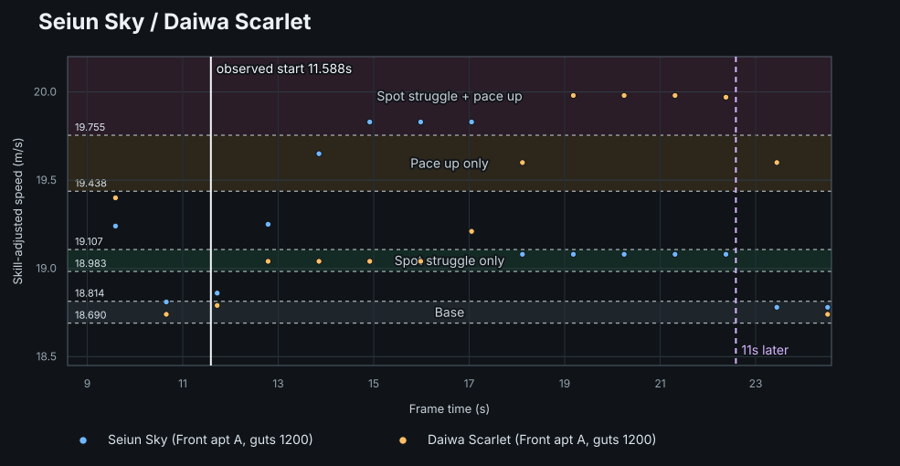

On the `22.38 s` race frame, both are still verifiably spot struggling:

| Character | Speed | Interpretation |
| --- | ---: | --- |
| Sei | `19.08 m/s` | Spot struggle only |
| Daiwa Scarlet | `19.97 m/s` | Spot struggle plus overtake mode |

By the `23.44 s` race frame, both have dropped back into non-spot-struggle speed ranges. That matches an approximately 11 second spot struggle starting at `11.588 s`.

The behavior changes for characters with poor Front Runner aptitude. In this [Special Week and Super Creek replay](https://hakuraku.moe/racedata?kv=2HQB16iaxHrYP4FbhYWj6uvh), spot struggle starts at `13.120 s`.

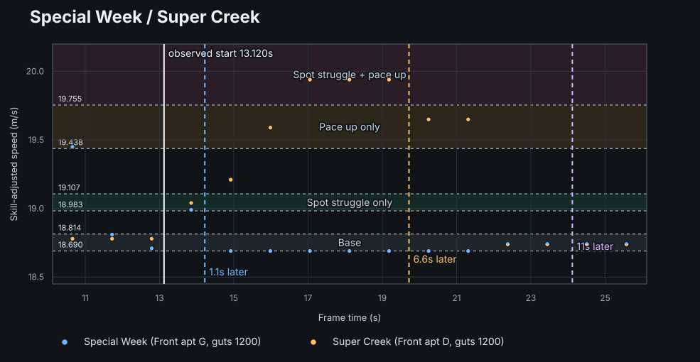

Special Week is already no longer spot struggling by the `14.92 s` race frame, with consecutive frames at `18.69 m/s`. Super Creek remains in spot struggle at the `19.14 s` frame with a speed of `19.94 m/s`, but by the `20.25 s` frame she has two consecutive frames at `19.65 m/s`. That is pace up mode without spot struggle.

So the observed upper bounds are:

| Character | Front Runner aptitude | Observed spot struggle duration |
| --- | --- | ---: |
| Special Week | G | `< 1.8 s` |
| Super Creek | D | `< 7.13 s` |

This matches a claim made in ルル's [spot struggle video](https://www.youtube.com/watch?v=soQGIsFQLaI): spot struggle duration is multiplied by the strategy proficiency modifier. With Front Runner aptitude G and D, Special Week and Super Creek would be expected to fall to roughly `1.1 s` and `6.6 s` respectively, which fits the observations very well.

I was not able to produce any race where Special Week verifiably spot struggled for more than 2 seconds, or any race where Super Creek verifiably spot struggled for more than 7 seconds. Given that Front Runner aptitude is the main meaningful difference between the test characters, I think the aptitude-scaled duration is very likely real.

## There may be a distance-based exit condition

I also found cases where spot struggle ended early even for A-aptitude Front Runners:

- [Race 1](https://hakuraku.moe/racedata?kv=EnPJcMr_3xqQas-HwP7-4N04): Sei starts spot struggling at `14.585 s`, but is already down to `18.78 m/s` by the `24.51 s` race frame.
- [Race 2](https://hakuraku.moe/racedata?kv=RY2q2NfKUnWSHH1wsUY8Cy5h): Sei starts spot struggling at `12.854 s`, but is back down to `18.8 m/s` by the `19.18 s` race frame.

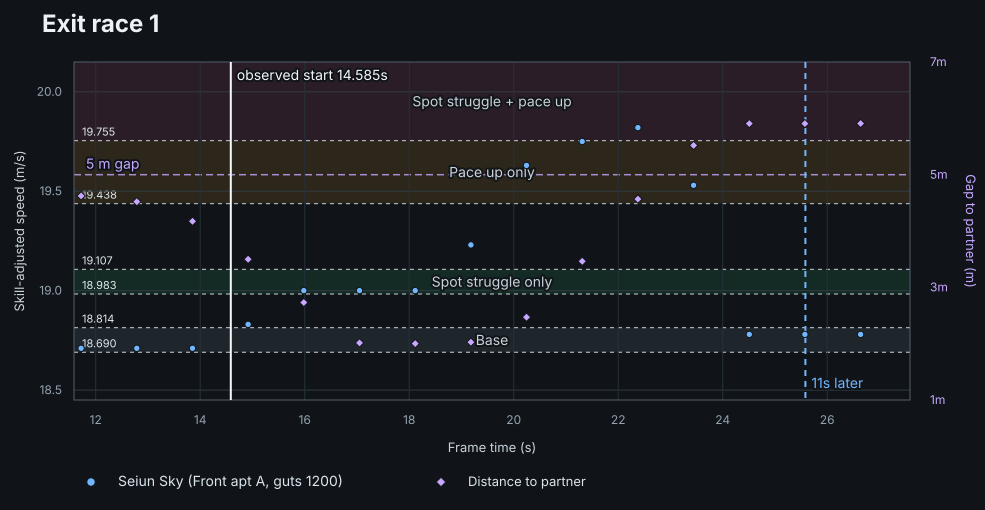

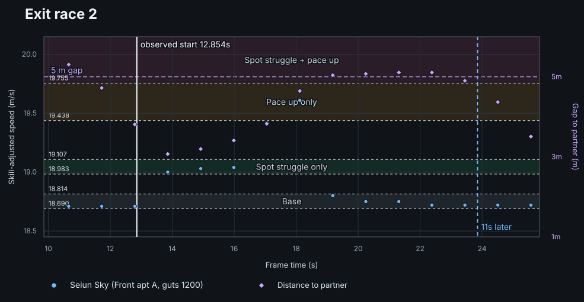

In both races, Sei gets more than 5 m ahead of the uma she started spot struggling with shortly before spot struggle ends.

That matters because the parameter file contains `DistanceGap2: 5.0`. The current documentation interprets this as the wider Oonige entry distance, compared to the `DistanceGap1: 3.75` entry distance for regular Front Runners. My suspicion is that `DistanceGap2` is instead, or at least also, used as a spot struggle exit distance.

## Oonige entry range does not look wider

To test whether Oonige really can start spot struggle from around 5 m away, I looked for races where two Suzukas approached each other from outside the normal Front Runner threshold:

- [Race 1](https://hakuraku.moe/racedata?kv=7p2zdLd81GxzHXJGtF2rsdZT): On the `26.64 s` frame, the two Suzukas are `4.4 m` apart and do not start spot struggling. On the `27.71 s` frame, they are `3.1 m` apart. Spot struggle begins at `27.173 s`.
- [Race 2](https://hakuraku.moe/racedata?kv=ETr8g4EwgjiJ9j8YsDJ5u8iT): On the `28.77 s` frame, the two Suzukas are `4.1 m` apart and do not start spot struggling. On the `29.84 s` frame, they are `3.3 m` apart. Spot struggle begins at `29.104 s`.

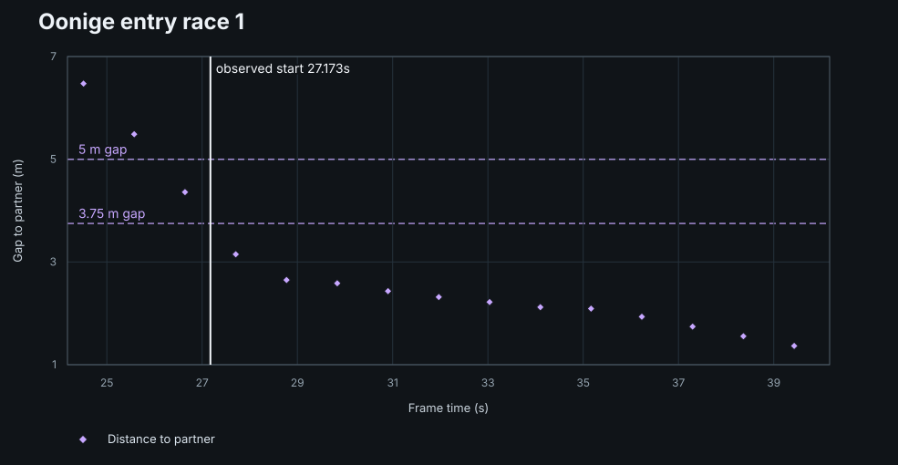

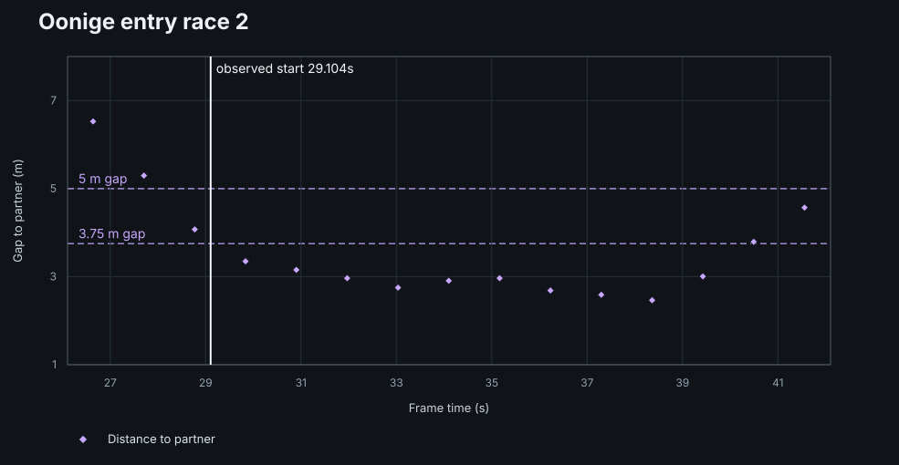

These replays do not support the idea that Oonige have a wider 5 m spot struggle entry range. They look much more consistent with the regular `DistanceGap1: 3.75` entry threshold.

## Addendum: Front S and three-way spot struggles

One of the first follow-up questions I received was whether the duration scaling also applies to Front Runner aptitude S. This [Kitasan Black and Bourbon replay](https://hakuraku.moe/racedata?kv=UoYZ26JgBIvxrzcfSZ3tAy0N) gives a clean check.

Bourbon starts spot struggling at `8.258 s` with `518` guts and Front Runner aptitude S. The unmodified duration would be:

$$
\sqrt{700 \cdot 518} \cdot 0.012 = 7.226\text{ s}
$$

That would expire at `15.484 s`. If Front S applies the expected `1.1x` strategy proficiency modifier, the duration becomes `7.95 s`, expiring at `16.2066 s`.

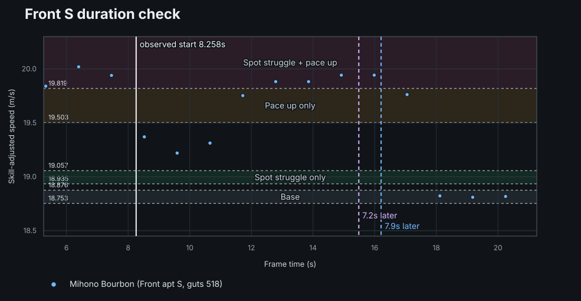

:::details Bourbon speed band calculation
| Step | Formula | Result |
| --- | --- | ---: |
| Course base speed | $20 - \frac{3200 - 2000}{1000}$ | `18.800 m/s` |
| Mood- and Front S-adjusted wit | $949 \cdot 1.04 \cdot 1.1$ | `1085.66` |
| Wit low roll | $18.8 \cdot \frac{\frac{1085.66}{5500}\log_{10}(1085.66 \cdot 0.1) - 0.65}{100}$ | `-0.047 m/s` |
| Wit high roll | $18.8 \cdot \frac{\frac{1085.66}{5500}\log_{10}(1085.66 \cdot 0.1)}{100}$ | `+0.076 m/s` |
| Base band | $18.8 + [-0.047,\ 0.076]$ | `18.753-18.876 m/s` |
| Spot struggle bonus | $(500 \cdot 518 \cdot 1.04)^{0.6} \cdot 0.0001$ | `0.181 m/s` |
| Spot struggle only | $18.8 + [-0.047,\ 0.076] + 0.181$ | `18.935-19.057 m/s` |
| Pace up only | $[18.753 \cdot 1.04,\ 18.876 \cdot 1.05]$ | `19.503-19.819 m/s` |
| Spot struggle + pace up | Any value above the pace up only band | `>19.819 m/s` |
:::

The speed observed on the `15.98 s` frame requires spot struggle to still be active, so it did not expire at the Front Runner aptitude A timing.

This observation requires at least a `1.06864x` duration modifier, so the expected `1.1x` Front S modifier fits.

## Exit conditions in three-way spot struggles

The next goal is to show how the distance-based exit condition behaves when more than two umas are spot struggling. In these examples, an uma exits only after she is more than `5 m` behind *all* other active spot strugglers. If every uma but one has exited due to this distance condition, the final spot struggler exits as well. Natural duration expiration does not count as a distance exit.

The examples below separate those cases one at a time.

In a three-way spot struggle, being more than `5 m` behind only the frontmost spot struggler is not enough. In this [Palmer replay](https://hakuraku.moe/racedata?kv=DXu9TlV4QnAwUBJL3zHbaVFl), Palmer is more than `7 m` behind the frontmost struggler on the `11.72 s` and `12.79 s` frames, but she remains in spot struggle because she is not yet more than `5 m` behind every other spot struggler.

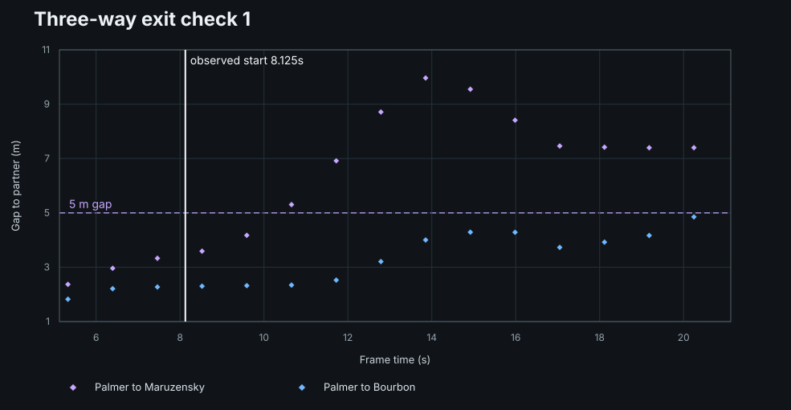

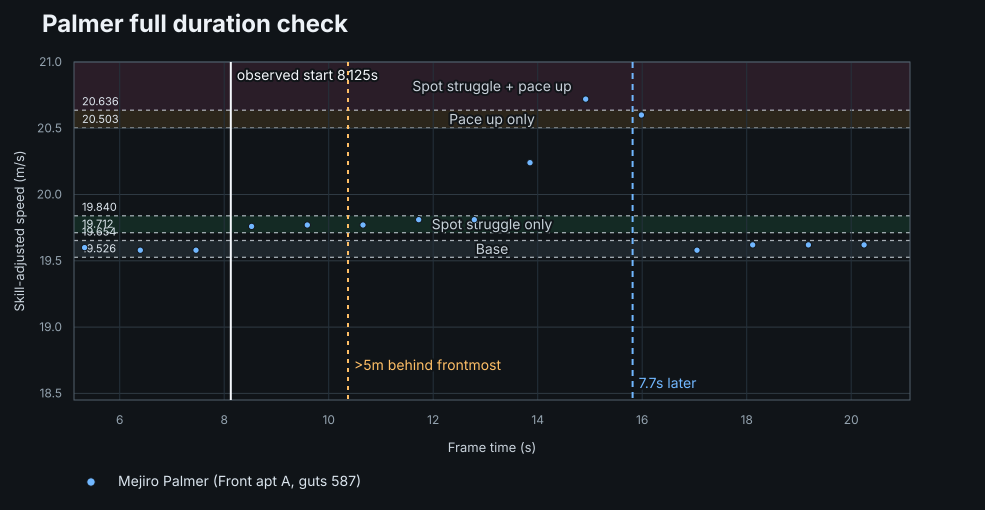

:::details Palmer speed band calculation
| Step | Formula | Result |
| --- | --- | ---: |
| Course base speed | $20 - \frac{2400 - 2000}{1000}$ | `19.600 m/s` |
| Mood-adjusted wit | $826 \cdot 0.96$ | `792.96` |
| Wit low roll | $19.6 \cdot \frac{\frac{792.96}{5500}\log_{10}(792.96 \cdot 0.1) - 0.65}{100}$ | `-0.074 m/s` |
| Wit high roll | $19.6 \cdot \frac{\frac{792.96}{5500}\log_{10}(792.96 \cdot 0.1)}{100}$ | `+0.054 m/s` |
| Base band | $19.6 + [-0.074,\ 0.054]$ | `19.526-19.654 m/s` |
| Spot struggle bonus | $(500 \cdot 587 \cdot 0.96)^{0.6} \cdot 0.0001$ | `0.186 m/s` |
| Spot struggle only | $19.6 + [-0.074,\ 0.054] + 0.186$ | `19.712-19.840 m/s` |
| Pace up only | $[19.526 \cdot 1.05,\ 19.654 \cdot 1.05]$ | `20.503-20.636 m/s` |
| Spot struggle + pace up | Any value above the pace up only band | `>20.636 m/s` |
:::

Palmer therefore does not exit spot struggle early just from being `5 m` behind the frontmost spot struggler.

However, in this [Ines Fujin replay](https://hakuraku.moe/racedata?kv=eYfn5Yb2xYwkgEZanyJ6J_tm), Ines stops spot struggling shortly after reaching a gap of more than `5 m` to both of her spot struggle partners, and is no longer spot struggling on the `12.79 s` and `13.85 s` frames.

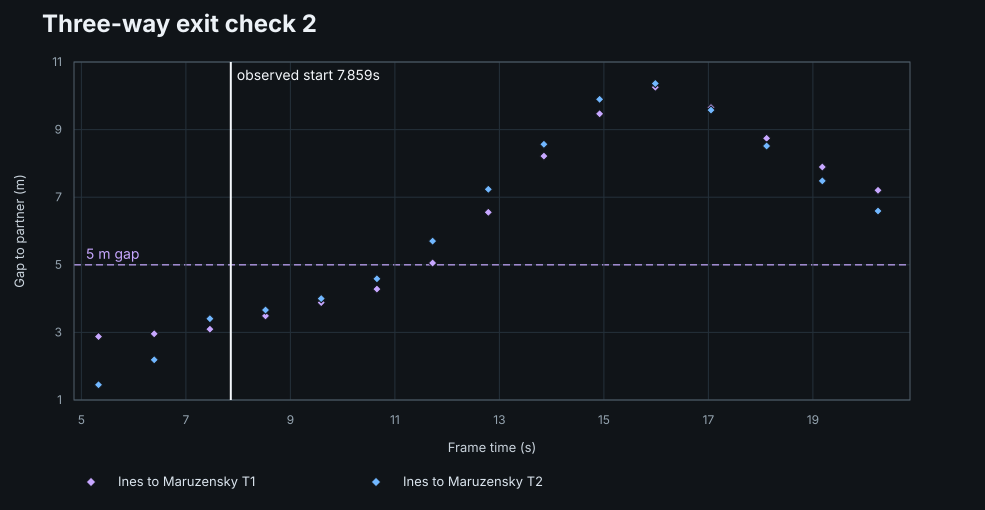

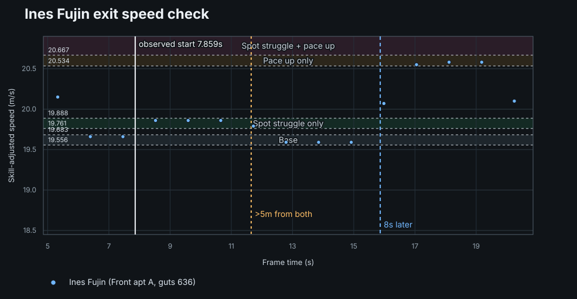

:::details Ines Fujin speed band calculation
| Step | Formula | Result |
| --- | --- | ---: |
| Course base speed | $20 - \frac{2400 - 2000}{1000}$ | `19.600 m/s` |
| Mood-adjusted wit | $1093 \cdot 1.04$ | `1136.72` |
| Wit low roll | $19.6 \cdot \frac{\frac{1136.72}{5500}\log_{10}(1136.72 \cdot 0.1) - 0.65}{100}$ | `-0.044 m/s` |
| Wit high roll | $19.6 \cdot \frac{\frac{1136.72}{5500}\log_{10}(1136.72 \cdot 0.1)}{100}$ | `+0.083 m/s` |
| Base band | $19.6 + [-0.044,\ 0.083]$ | `19.556-19.683 m/s` |
| Spot struggle bonus | $(500 \cdot 636 \cdot 1.04)^{0.6} \cdot 0.0001$ | `0.205 m/s` |
| Spot struggle only | $19.6 + [-0.044,\ 0.083] + 0.205$ | `19.761-19.888 m/s` |
| Pace up only | $[19.556 \cdot 1.05,\ 19.683 \cdot 1.05]$ | `20.534-20.667 m/s` |
| Spot struggle + pace up | Any value above the pace up only band | `>20.667 m/s` |
:::

So the `5 m` exit condition observed in the two-uma examples still appears to exist, but with more participants it requires being behind *all* other active spot strugglers by `5 m`.

The same rule also explains the cascade cases. In this [first replay](https://hakuraku.moe/racedata?kv=hiWgHLvoDu5nvHvXjz8D-gGh), Team 1 Bourbon exits around the `12.79 s` frame after falling at least `5 m` behind both other spot strugglers. Around the `13.85 s` frame, Sei and Team 3 Bourbon also get too far apart, leading both of them to exit early.

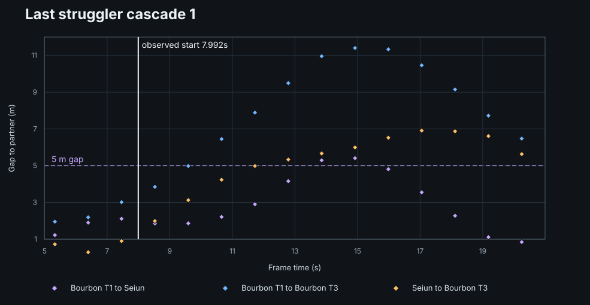

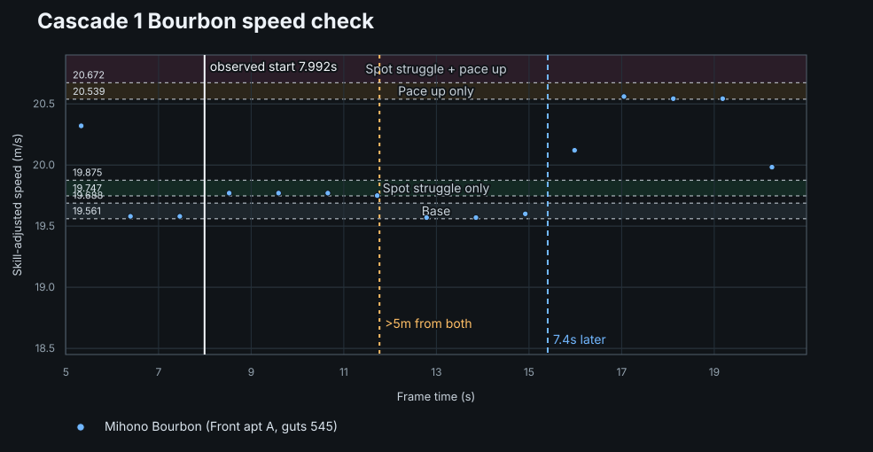

:::details Cascade 1 Bourbon speed band calculation
| Step | Formula | Result |
| --- | --- | ---: |
| Course base speed | $20 - \frac{2400 - 2000}{1000}$ | `19.600 m/s` |
| Mood-adjusted wit | $1143 \cdot 1.04$ | `1188.72` |
| Wit low roll | $19.6 \cdot \frac{\frac{1188.72}{5500}\log_{10}(1188.72 \cdot 0.1) - 0.65}{100}$ | `-0.039 m/s` |
| Wit high roll | $19.6 \cdot \frac{\frac{1188.72}{5500}\log_{10}(1188.72 \cdot 0.1)}{100}$ | `+0.088 m/s` |
| Base band | $19.6 + [-0.039,\ 0.088]$ | `19.561-19.688 m/s` |
| Spot struggle bonus | $(500 \cdot 545 \cdot 1.04)^{0.6} \cdot 0.0001$ | `0.187 m/s` |
| Spot struggle only | $19.6 + [-0.039,\ 0.088] + 0.187$ | `19.747-19.875 m/s` |
| Pace up only | $[19.561 \cdot 1.05,\ 19.688 \cdot 1.05]$ | `20.539-20.672 m/s` |
| Spot struggle + pace up | Any value above the pace up only band | `>20.672 m/s` |
:::

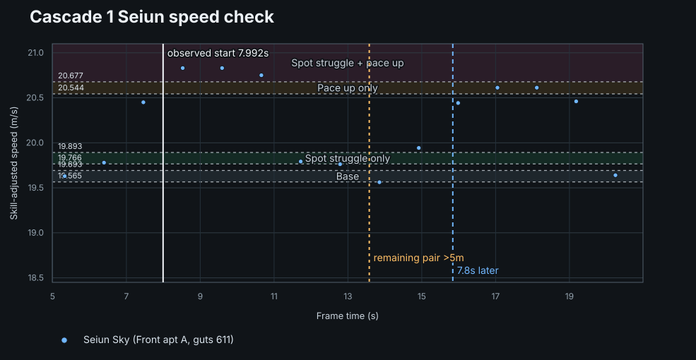

:::details Cascade 1 Sei speed band calculation
| Step | Formula | Result |
| --- | --- | ---: |
| Course base speed | $20 - \frac{2400 - 2000}{1000}$ | `19.600 m/s` |
| Mood-adjusted wit | $1196 \cdot 1.04$ | `1243.84` |
| Wit low roll | $19.6 \cdot \frac{\frac{1243.84}{5500}\log_{10}(1243.84 \cdot 0.1) - 0.65}{100}$ | `-0.035 m/s` |
| Wit high roll | $19.6 \cdot \frac{\frac{1243.84}{5500}\log_{10}(1243.84 \cdot 0.1)}{100}$ | `+0.093 m/s` |
| Base band | $19.6 + [-0.035,\ 0.093]$ | `19.565-19.693 m/s` |
| Spot struggle bonus | $(500 \cdot 611 \cdot 1.04)^{0.6} \cdot 0.0001$ | `0.200 m/s` |
| Spot struggle only | $19.6 + [-0.035,\ 0.093] + 0.200$ | `19.766-19.893 m/s` |
| Pace up only | $[19.565 \cdot 1.05,\ 19.693 \cdot 1.05]$ | `20.544-20.677 m/s` |
| Spot struggle + pace up | Any value above the pace up only band | `>20.677 m/s` |
:::

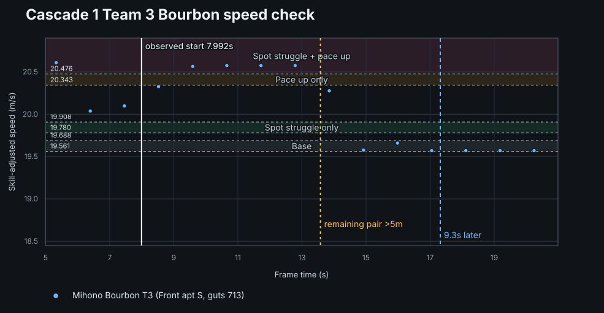

:::details Cascade 1 Team 3 Bourbon speed band calculation
| Step | Formula | Result |
| --- | --- | ---: |
| Course base speed | $20 - \frac{2400 - 2000}{1000}$ | `19.600 m/s` |
| Mood- and Front S-adjusted wit | $1043 \cdot 1.04 \cdot 1.1$ | `1193.19` |
| Wit low roll | $19.6 \cdot \frac{\frac{1193.19}{5500}\log_{10}(1193.19 \cdot 0.1) - 0.65}{100}$ | `-0.039 m/s` |
| Wit high roll | $19.6 \cdot \frac{\frac{1193.19}{5500}\log_{10}(1193.19 \cdot 0.1)}{100}$ | `+0.088 m/s` |
| Base band | $19.6 + [-0.039,\ 0.088]$ | `19.561-19.688 m/s` |
| Spot struggle bonus | $(500 \cdot 713 \cdot 1.04)^{0.6} \cdot 0.0001$ | `0.220 m/s` |
| Spot struggle only | $19.6 + [-0.039,\ 0.088] + 0.220$ | `19.780-19.908 m/s` |
| Pace up only | $[19.561 \cdot 1.04,\ 19.688 \cdot 1.04]$ | `20.343-20.476 m/s` |
| Spot struggle + pace up | Any value above the pace up only band | `>20.476 m/s` |
:::

In this [second replay](https://hakuraku.moe/racedata?kv=78b0f0mdvs9G2bvQAY1ZfU7z), Sei falls more than `5 m` behind both other spot strugglers around the `13.85 s` frame and exits. Around the `15.98 s` frame, Bourbon and Grass Wonder form a `5 m` gap; that satisfies the distance exit for Grass, and Bourbon exits because she is then the last remaining active spot struggler.

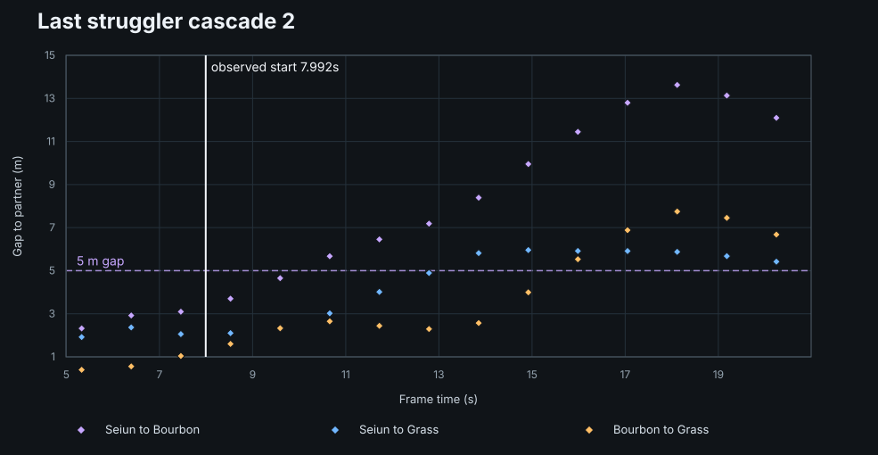

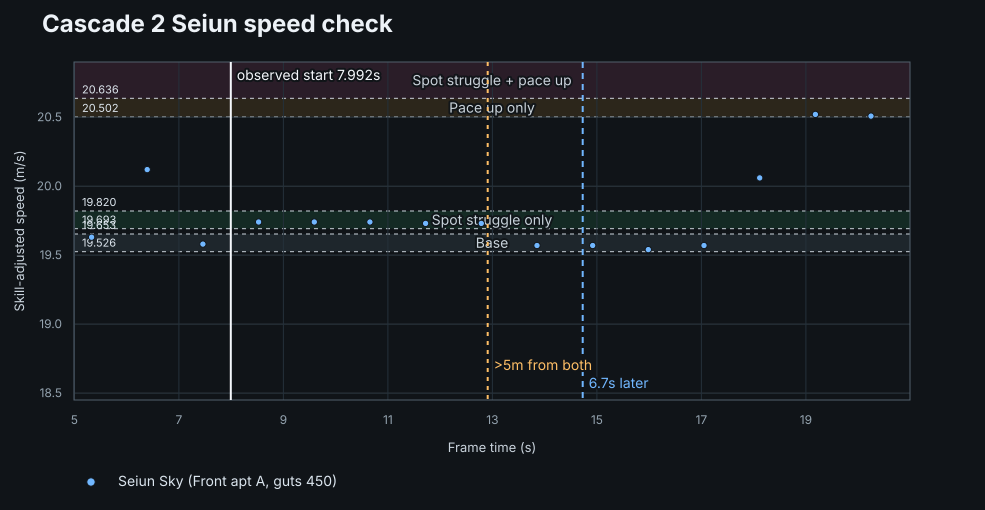

:::details Cascade 2 Sei speed band calculation
| Step | Formula | Result |
| --- | --- | ---: |
| Course base speed | $20 - \frac{2400 - 2000}{1000}$ | `19.600 m/s` |
| Mood-adjusted wit | $759 \cdot 1.04$ | `789.36` |
| Wit low roll | $19.6 \cdot \frac{\frac{789.36}{5500}\log_{10}(789.36 \cdot 0.1) - 0.65}{100}$ | `-0.074 m/s` |
| Wit high roll | $19.6 \cdot \frac{\frac{789.36}{5500}\log_{10}(789.36 \cdot 0.1)}{100}$ | `+0.053 m/s` |
| Base band | $19.6 + [-0.074,\ 0.053]$ | `19.526-19.653 m/s` |
| Spot struggle bonus | $(500 \cdot 450 \cdot 1.04)^{0.6} \cdot 0.0001$ | `0.167 m/s` |
| Spot struggle only | $19.6 + [-0.074,\ 0.053] + 0.167$ | `19.693-19.820 m/s` |
| Pace up only | $[19.526 \cdot 1.05,\ 19.653 \cdot 1.05]$ | `20.502-20.636 m/s` |
| Spot struggle + pace up | Any value above the pace up only band | `>20.636 m/s` |
:::

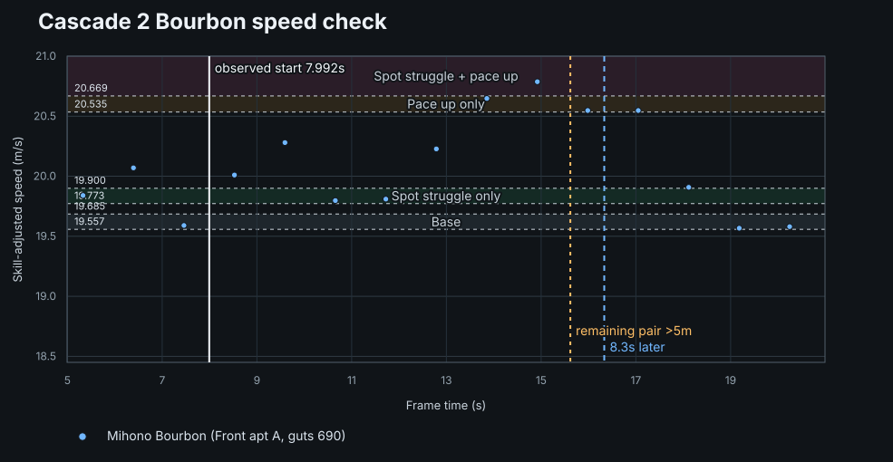

:::details Cascade 2 Bourbon speed band calculation
| Step | Formula | Result |
| --- | --- | ---: |
| Course base speed | $20 - \frac{2400 - 2000}{1000}$ | `19.600 m/s` |
| Mood-adjusted wit | $1109 \cdot 1.04$ | `1153.36` |
| Wit low roll | $19.6 \cdot \frac{\frac{1153.36}{5500}\log_{10}(1153.36 \cdot 0.1) - 0.65}{100}$ | `-0.043 m/s` |
| Wit high roll | $19.6 \cdot \frac{\frac{1153.36}{5500}\log_{10}(1153.36 \cdot 0.1)}{100}$ | `+0.085 m/s` |
| Base band | $19.6 + [-0.043,\ 0.085]$ | `19.557-19.685 m/s` |
| Spot struggle bonus | $(500 \cdot 690 \cdot 1.04)^{0.6} \cdot 0.0001$ | `0.215 m/s` |
| Spot struggle only | $19.6 + [-0.043,\ 0.085] + 0.215$ | `19.773-19.900 m/s` |
| Pace up only | $[19.557 \cdot 1.05,\ 19.685 \cdot 1.05]$ | `20.535-20.669 m/s` |
| Spot struggle + pace up | Any value above the pace up only band | `>20.669 m/s` |
:::

Since Grass' spot struggle duration expired very early here, this also reinforces that natural duration expiration will not cause *other* umas to exit spot struggle early if they have duration left, similarly to how earlier Special Week's spot struggle expired very early due to her G aptitude, but it did not impact the spot struggle duration of the second spot struggler.

## Exiting due to lateral distance

As previously mentioned, it is likely that `LaneGap2`'s value of `0.416` is also an exit condition. In practice, this will essentially only ever happen if one spot struggler uses Dodging Danger/Sixth Sense during spot struggle and none of the others do, or all others do and one spot struggler is left behind at the rail.

In this [Sei and Daiwa replay](https://hakuraku.moe/racedata?kv=y5_UPJb-zg0X9nFKvSImVria), on the `12.79 s` and `13.85 s` frames, Sei is firmly pinned to `5000` lane position due to Dodging Danger, causing a large lateral gap to Daiwa. After the frame where they become 4160 lane distance (i.e. 0.416 course widths) apart, Daiwa's target speed does not appear to include spot struggle's speed bonus anymore.

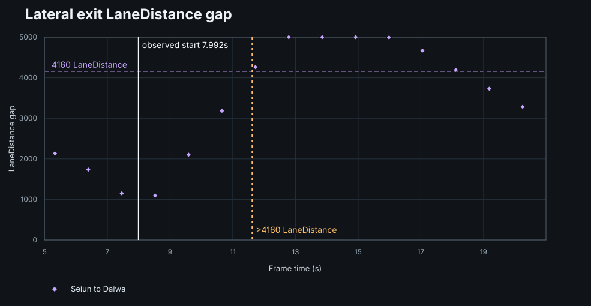

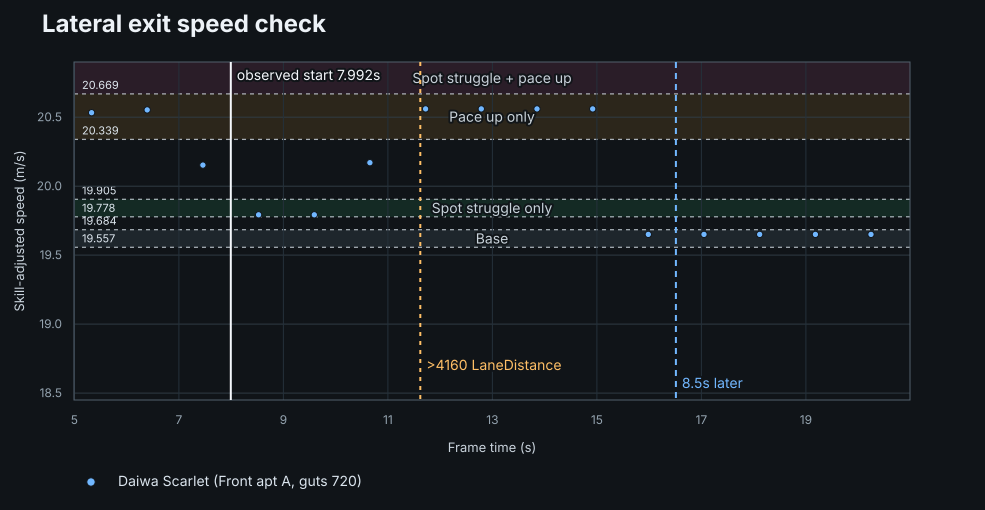

## Entry conditions

Since I already have the data available, let's graph all spot struggle entries in the CM13 umalogs dataset to empirically verify the `3.75 m` / `0.165` course width entry range for spot struggle. Note that the y axis is lane distance rather than course width; `0.165` course width is `1650` lane distance.

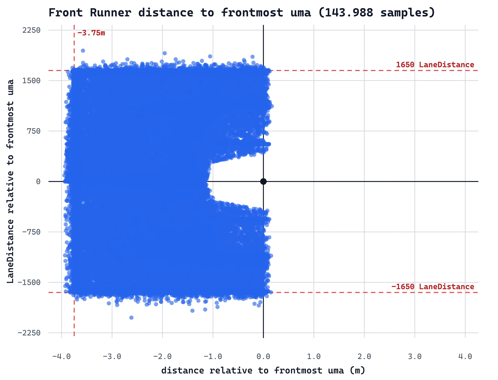

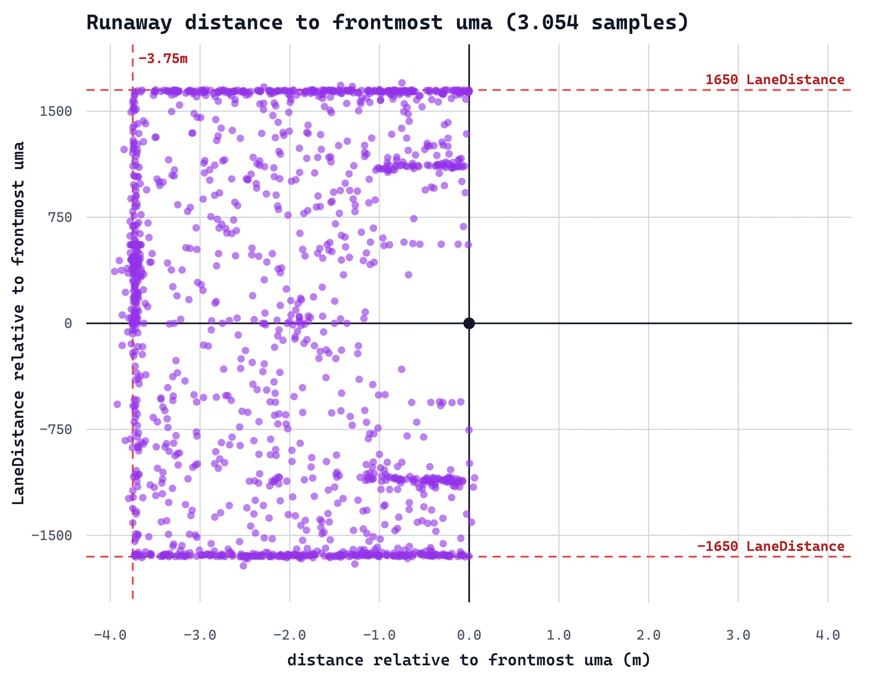

The minimum race distance of `150 m` and maximum of section 6 also have some interesting details. For the `150 m` minimum, *any* uma in the race passing `150 m` appears to unlock spot struggle for everyone. In practice, this means Front Runners can start spot struggling earlier, as in this [Oonige + Front Runners replay](https://hakuraku.moe/racedata?kv=o5rX0k76v2oRrkFJhwrLLLAE), where the Front Runners enter spot struggle around `137 m` because Suzuka (Oonige) has already gone ahead and passed the `150 m` mark.

For the maximum distance, my best guess is that only one of the umas involved in triggering spot struggle needs to still be within section 6. In this [Maruzensky and Bourbon replay](https://hakuraku.moe/racedata?kv=fzTx9KH-afESWaKPfLrqAE1L), we were sent the exact race frame where spot struggle triggered. Maruzensky was already at `602.8 m` on a course where section 6 ends at `600 m`, but Bourbon was still at `599.2 m` and managed to trigger spot struggle with her.

For anyone looking into this in the future, one useful detail is that the first uma in the spot struggle event params is always the reference uma for the spot struggle distance check.

## Conclusion

The mechanics of spot struggle appear to work as follows.

While in spot struggle, target speed increases by:

$$
\Delta v = (500 \cdot \operatorname{Guts})^{0.6} \cdot 0.0001
$$

The duration appears to be:

$$
t = (700 \cdot \operatorname{Guts})^{0.5} \cdot 0.012 \cdot \operatorname{StrategyProficiencyModifier}
$$

where the Front Runner strategy proficiency modifier is:

| Aptitude | Modifier |
| --- | ---: |
| S | `1.1` |
| A | `1.0` |
| B | `0.85` |
| C | `0.75` |
| D | `0.6` |
| E | `0.4` |
| F | `0.2` |
| G | `0.1` |

Spot struggle can trigger once any uma in the race has passed the `150 m` mark, and at least one of the umas attempting to proc it has yet to have passed section 6.

It triggers when another uma of the same running style is within `3.75 m` behind the frontmost Front Runner or Oonige and at most `0.165` course widths away laterally. Upon triggering, all umas within `3.75 m` and `+/- 0.165` course widths of the frontmost uma of that style enter spot struggle together. Each style can only trigger spot struggle once per race.

An uma exits spot struggle if she is `5 m` behind or `0.416` course lengths away laterally from all other  spot strugglers of her style, losing the target speed bonus even if her duration has not expired. If all other spot strugglers have triggered the distance exit condition, the final spot struggler exits as well.
